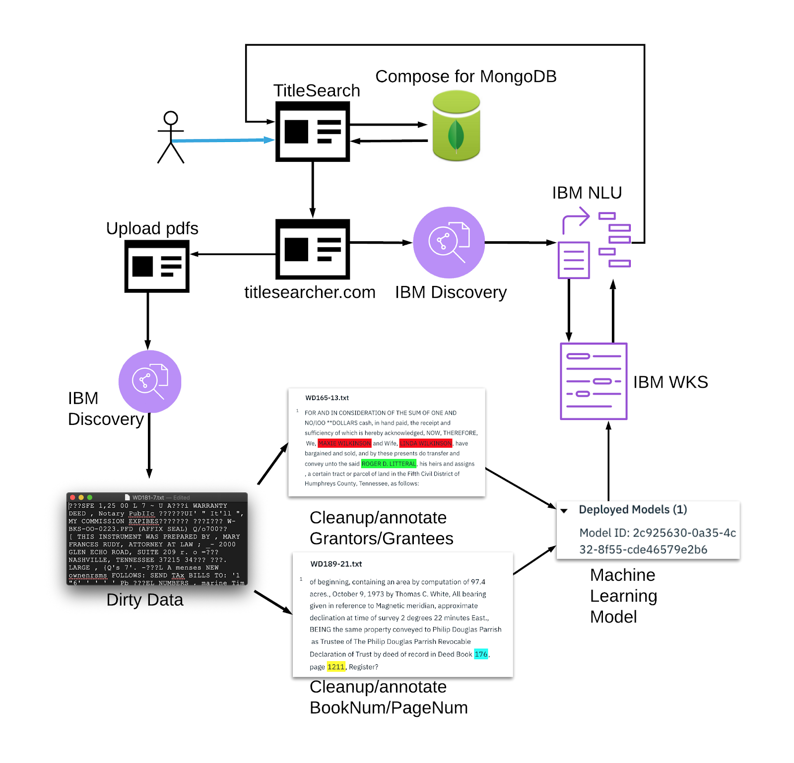
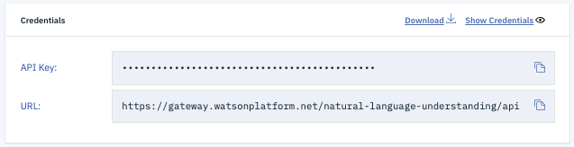
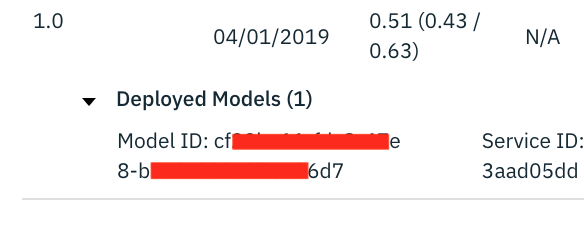

# Watson Knowledge Studio
Watson Knowledge Studio allows application of a machine learning model to a Natural Language Understanding service. By creating a WKS model, a call to the Natural Language Understanding in the Watson Developer Cloud SDK will output desired entities from a block of text.

## Process

## Downloading Raw Warranty Deeds 
The process of training Watson Knowledge Studio is outlined in this section. The process starts with titlesearcher.com. The TitleSearcherAPI is used to access and bulk download a set of warranty deeds in PDF format. These are the deeds that Watson Knowledge Studio will be trained on. This is outlined in [document-extraction.md](document-extraction.md). Document extraction needs to be done before anything related to Watson Knowledge Studio. 

## Turning the .pdf into .txt
The next issue is in parsing out the text of these documents. Since they are scanned PDF pages, they must be passed into IBM Discovery via our custom titlesearch.mybluemix.net/upload.jsp. The process for pushing upload.jsp live is outlined [here](discovery.md). When uploading, the "No file chosen" message will return once the document has been successfully passed to Discovery.

Once a document is uploaded into Discovery, it will be placed in a queue for transforming into a .txt format. Users may need to wait for the queue to finish processing before proceeding to the next step. 

## Downloading .txt files
Navigate to titlesearch.mybluemix.net/query.jsp for extraction of the .txt files from the Discovery service. Open Chrome DevTools with ```F12```. Enter the name of each file uploaded into the Discovery service, hit enter, then paste [/scripts/extractText.js](scripts/extractText.js) into the DevTools console. Hit enter. The script will automatically download the .txt file.

## Cleaning the Data
Discovery service has trouble parsing the text from these documents, as many are scanned poorly, lack standardization, do not follow paragraph format (in boxes), or handwritten. Because of this, a human is required to go through the .txt files. We want to train WKS on snippets of the necessary information, without miscellaneous information, letters, and characters that have nothing to do with the desired entity extractions. 

Each raw .txt file will be split two ways into two other .txt files.
- file with the transfer of ownership paragraph. This is for entity extraction on Grantors and Grantees.
- file with the end of the land description, wherein the warranty deed specifies the next warranty deed book and page number we need to pull up. 

In creating the new .txt files, make sure to keep both the original .pdf and .txt file in case cross-referencing is needed. 

## Uploading files into WKS 
In order to create the trained machine learning model, we need to annotate the documents. 

Create a new WKS service. Upload the new documents by dragging multiple related documents in at the same time. This creates a document set. Keep the two different file types separate, as we want to train related documents at the same time. 

Document sets have been kept to around 20 documents for iterative and manageable purposes. 

## Create Annotation Sets
Create annotation sets based on the document sets. You can group related document sets together.

## Create Annotation Task
Create annotation tasks based on the annotation sets. Each task will represent the last step before training. 

Now, go through the annotation task, highlighting each entity respectively. Setting keybindings like 1,2,3,4 for the different entity annotation will speed up the process. 

After finishing annotations, ```Submit All Documents``` in the annotation tasks. Then ```Accept``` the submissions to push to ground truth.

## Anecdotal Experimentation
Experimenting with relationships between entities on the datasets ended up not being worthwhile. On iterative testing, relationhip annotations did not increase the accuracy of the model's entity extraction. I believe this has to do with the fact that entity extraction does not rely on relationships at all, as relationships can be extracted separately. 

The same applies to coreference chains. I mistakenly believed that coreference chains applied to entity annotations would increase the entity extraction score, but was wrong in this regard. 

Thus, the only thing necessary for entity extraction is actual entity annotations, proving all of the coreference and relationship annotations futile. 

## Training the model
Once you finish all annotation tasks, in the ```Performance``` tab, train the model on the annotation sets. 

## Deploy the model
Go to the ```Version``` tab and click ```Create Version```. Now click ```Deploy``` and deploy this model to a previously created NLU service. This NLU service is the one you will be interfacing with directly. 

## Saving Progress and/or Migrating to a New WKS Instance 
Do not go too long without downloading the Corpus and Type System (and trained model if on paid plan) to your system. Also, keep them under version control or email them to yourself for any doomsday scenarios (e.g., accidentally deleting the WKS instance you had been training for the entire semester).

## Extracting Entities
Test the entity extraction. If you would like to test the NLU, you can do so in this /assets/ directory. You can find the  test files: [test.java](testNLU/test.java) and [nluAPI.java](testNLU/nluAPI.java) in the [testNLU](testNLU/) directory. These are pared down versions of the fully-implemented NLU files for testing purposes. The ```nluAPI.java``` is derived from the [Watson Developer Cloud Java SDK](https://github.com/watson-developer-cloud/java-sdk/tree/master/natural-language-understanding). 

You must add [the dependencies](https://github.com/watson-developer-cloud/java-sdk#jar) to your project's build path. 

```java
private static final String API_KEY = "p42yaE...";
private static final String URL = "https://gateway.watsonplatform.net/natural-language-understanding/api/";
private static final String MODEL_NO = "2c925630-0a...";
```

API_KEY
- the API key is specific to your NLU service you deployed your trained WKS model to. Find this under IBMClodu > {your NLU service} > Manage. This is shown below.

URL
- the URL is specific to the region your service is deployed to. This is available under IBMCloud > {your NLU service} > Manage. This URL is specific to the Dallas region. This is shown below.


MODEL_NO
- the modelID of your trained WKS service. This is located under IBMCloud > {your WKS service} > Manage > Launch Tool > Machine Learning Model > Versions 


---

The actual NLU java file is found in the source code [here](/src/main/java/com/seniordesign/titlesearch/NaturalLanguageUnderstandingAPI.java)

## Type System
The current type system is comprised of the entities WarrDeedPageNum, WarrDeedBookNum, Grantor, and Grantee. This must be applied before uploading your corpus, as the annotations are reliant on the type system. The type system up to this point is found in [/wksAssets/types-5c95...json/](wksAssets/types-5c953ef0-5481-11e9-9b8e-4bc9d96d3dde.json). To apply these to your WKS service, go to Assets > Entity Types > Upload.

## Corpus
The ground truth, or corpus, for this project up to this point can be found in [/wksAssets/corpus-5c95...zip/](wksAssets/corpus-5c953ef0-5481-11e9-9b8e-4bc9d96d3dde.zip/). This holds the documents and annotations available up to this point. To apply these to your WKS service, go to Assets > Documents > Upload Document Sets.

## Run
Running test.java with the proper credentials will output a JSON object containing the extracted entities from a group of text. A test text string has been inputted, with both grantors and grantees.

